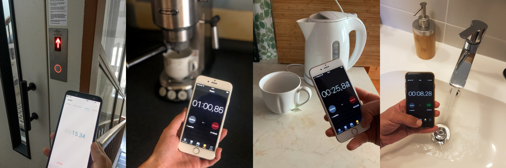
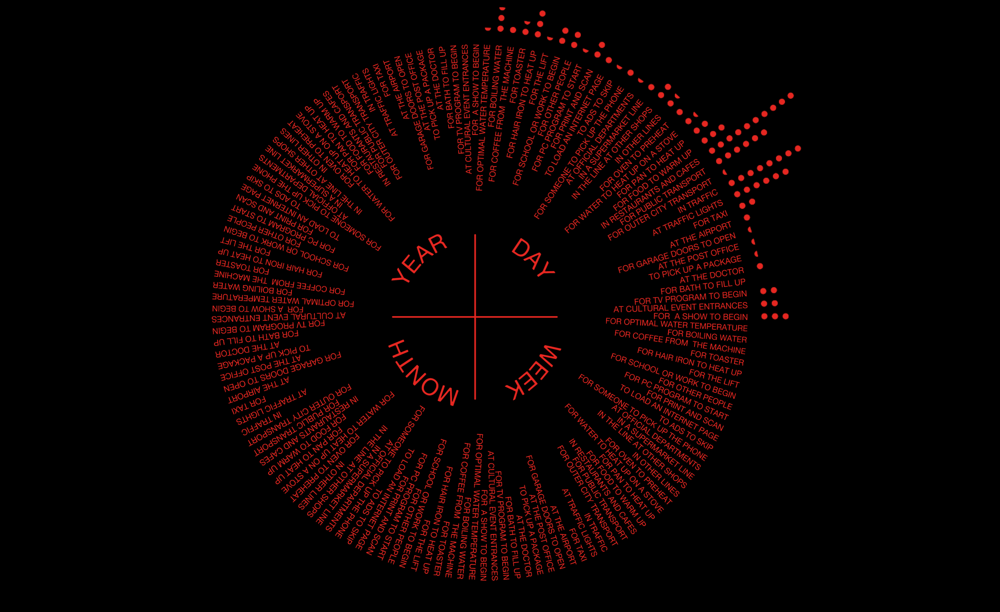
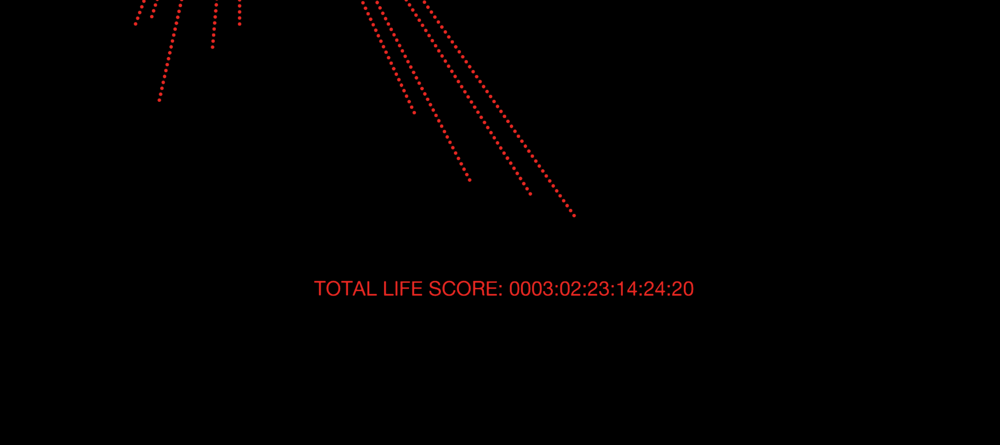
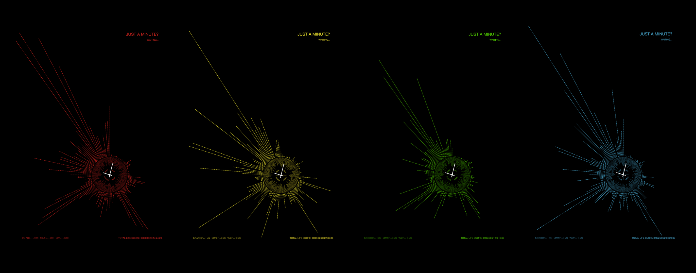

# Case study- Infographic

I created this project with my classmates as a part of a semester work at the end of the last academic year. 

We were supposed to work in small groups of 4. At first, we chose the topic of our graph - Waiting. 

The graph shows the time we spend waiting in our daily lives. In a day, a week, a month and a year. We wanted to show differences in waiting between each of our lives.
 
After a long discussion, we agreed on all the items we were going to measure. What counts as waiting is quite a philosophical question, so it wasn’t easy.

Then we started by collecting data. 

`Pictures of how we measure individual activities.`

Everyone measured the time spent waiting during our daily activities. For example, heating water, making coffee, waiting in traffic jams etc. 
We also tried to estimate how much time we spend waiting during occasional activities, such as waiting at airports, at the doctor, at cultural events entrances…

`All our data.`

## Visual part

The shape of our graph represents an analogue clock. Clock face as a symbol of time. We put all our periods into this shape. The same activities occur for each period.

A dot is a unit of measurement. For a day and a week, one dot represents a minute. For a month it’s three minutes and for a year it pictures fifteen minutes.

`Where we wait.`

We decided to calculate how much time each of us spends waiting in a lifetime. (Of course if we would live the same way as now.) 

`Total life score of waiting.`

We made graphs for everyone of us and then one together, which shows the divergence between us. 

`Posters of every of us.`

`Common graph.`

We have suggested how our graphs can be presented in real space. We decided to project the data using a projector in a narrow space. So that time surrounds the viewer.

