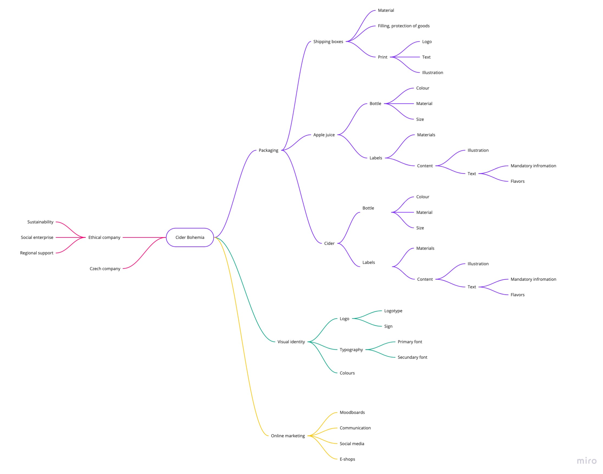

# Packaging design of Cider Bohemia 

In my thesis I will create a visual identity and packaging design of the company Cider Bohemia. It is a Czech company producing products from apples - ciders, musts and apple vinegar.

  
Mind Map

  

### Voice & Tone

- **Voice:** confident, educated, and inspirational
- **Tone:** Formal, clear but also friendly and posstitive 

## Outline

1. 
2. Key point; aim for a single-sentence in 120 characters or less.
3. Key point; aim for a single-sentence in 120 characters or less.
4. Key point; aim for a single-sentence in 120 characters or less.
5. Key point; aim for a single-sentence in 120 characters or less.
6. Another key point?
7. Too long, didn’t read?

### Notes

- …
- …
- …

## Keywords

- **Corporate identity**
  - Definition/description; aim for a single-sentence in 120 characters or less.
- **Visual identity**
  - Definition/description; aim for a single-sentence in 120 characters or less.
- **Sustainable Packaging**
  - Definition/description; aim for a single-sentence in 120 characters or less.
- **Social networks**
  - Definition/description; aim for a single-sentence in 120 characters or less.
- **Cider**
  - Definition/description; aim for a single-sentence in 120 characters or less.

### References
- [Reference](http://)
- [Reference](http://)
