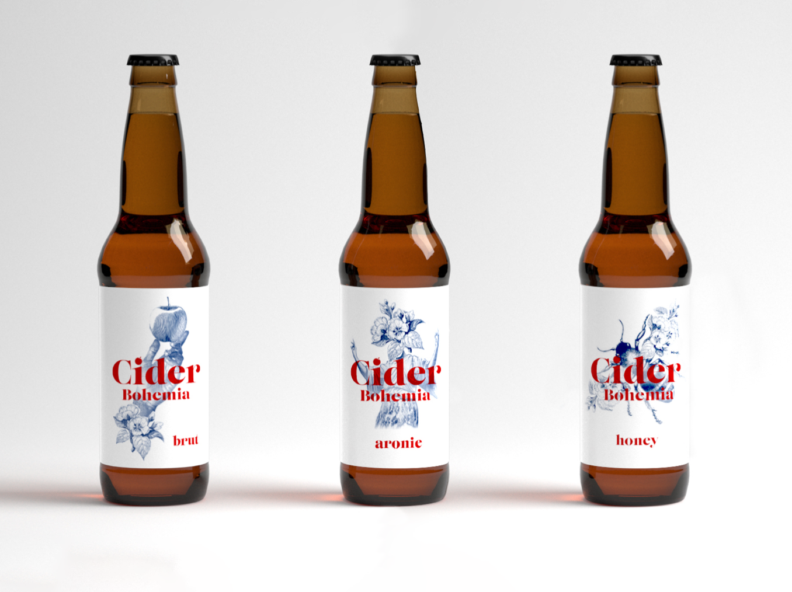

# Packaging design and visual identity of brand Cider Bohemia

### Draft
The bachelor thesis deals creation the visual identity and packaging design of existing brand.  A new visual style for the company Cider Bohemia, which produces apple products - especially ciders.
The aim of the work is to create a design that will be attractive to customers and at the same time based on the company's philosophy and does not unnecessarily burden the environment.
The theoretical part is devoted to research in the field of creating a new corporate identity and packaging design. The practical part is dealing with creation of a single visual style and the transfer of this style to the packaging design - for labels, boxes and other packaging.
The result of my work is the creation of a recognizable original visual style containing a new logo, illustration, online promotional materials, labels and packaging.

Keywords: corporate identity, visual identity, packaging design, sustainability

### New version 
The bachelor thesis explores the creation of the visual identity and packaging design of an existing brand - Cider Bohemia, which produces apple products - especially ciders. The current design has several problems. It is inconsistent, difficult to identify and not very attractive. I wanted to make better brand awareness. Good design leads to marketing, to identify the brand, to make brand recognizable. The aim of the work is to create a design that will be attractive to customers and at the same time based on the company's philosophy and does not unnecessarily burden the environment.

The theoretical part is devoted to research in the field of creating a new corporate identity and packaging design. The practical part is dealing with creation of a single visual style and the transfer of this style to the packaging design - for labels, boxes and other packaging.
The result of my work is the creation of a recognizable original visual style containing a new logo, illustration, online promotional materials, labels and packaging.

Keywords: corporate identity, visual identity, packaging design, sustainability
