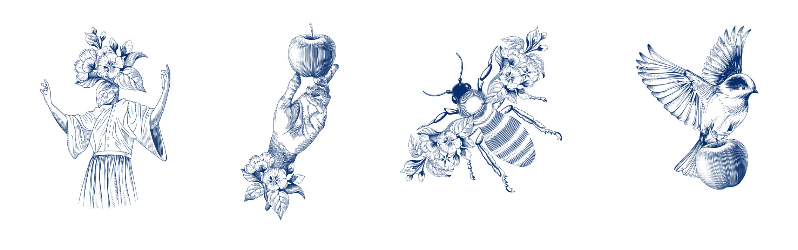

# Packaging design and visual identity of brand Cider Bohemia

`Design of new labels for Cider Bohemia`

## Abstract
This bachelor thesis explores the visual identity and product packaging redesign of the brand Cider Bohemia, producer of apple products, mainly ciders. The work aims to create a design that will be attractive to customers and at the same time based on the company's philosophy and does not unnecessarily burden the environment. The redesign process focuses on strengthening brand identity through a more consistent visual design language, visible in product packaging to marketing materials. The redesign intends to demonstrate that good design is good business, leading to good brand awareness and experience.

The theoretical part examines the research in the field of developing a new corporate identity and packaging design. The practical part documents a single visual style applied to packaging design (labels, boxes, etc.). The resulting work is to create a recognizable original visual style, cohesively applied to a new logo, illustrations, labeling and packaging, and online promotional materials.

Keywords: corporate identity, visual identity, packaging design, sustainability

## Cider Bohemia
### About company 
Cider Bohemia is a social enterprise. The company mainly employs people with disabilities, people at risk of social exclusion and the long-term unemployable.
The company's philosophy is to live with respect for other people and nature. They use a method of production that not unnecessarily burden the environment. The company use only local resources. 

Company mostly produce craft cider using traditional methods. It owns firt Cider pub in Czech republic.

### Current visual style
The main problem of the current visual style is its inconsistency. The company uses different logos and different label designs for each flavor. This raises several problems. For customers, this company is not very recognizable in the competition and is difficult to remember. Personally, I don't think current labels are very attractive.

`Current labels of Cider Bohemia`

## New visual style - Concept
I decided to work with the word Bohemia, not only as the name of the Czech land, but also with the theme of bohemianism, as a lifestyle. I try to evoke the atmosphere of Czech romantic bohemianism. It's based on inspiration in Czech romanticism, where Czech bohemians are a frequent subject. 

### Moodboard
The moodboard shows the atmosphere of Czech romanticism. Wildness of the Czech countryside. Aesthetics of the 19th century.

`Moodboard concept Bohemia`

### Logotype
The logotype is created from a serif font. The dot on the letter "i" is transformed into an apple. I also use the apple itself as a sign/logo in combination with letter B.

`Logo for Cider Bohemia`

### Illustrations
The illustrations are drawn to act as line drawings. They are created on a tablet in Adobe Fresco, a tool for digital drawing. 
The themes of the illustrations are a bit surreal. They should show bohemian free thinking and connection with nature.

`Illustrations`

### Labels

### Instagram

### Other materials

## References
Books
1.	VYSEKALOVÁ, Jitka a Jiří MIKEŠ. Image a firemní identita
2.	KAFKA, Ondřej a Michal KOTYZA. Logo & corporate identity
3.	HEALEY, Matthew. Co je branding?
4.	DUPUIS, Steven a John SILVA. Package design workbook: the art and science of successful packaging
5.	HELLER, Jan. 1000 Obalový design. Nejlepší nápady pro kartony, krabice, tašky a láhve
6.	CALVER, Giles. What is packaging design?. Mies, Švýcarsko: RotoVision
7.	AIREY David. Logo, nápad, návrh, realizace
8.	UHROVÁ, Helena. Jak se dělá cidre, calvados, pommeau

